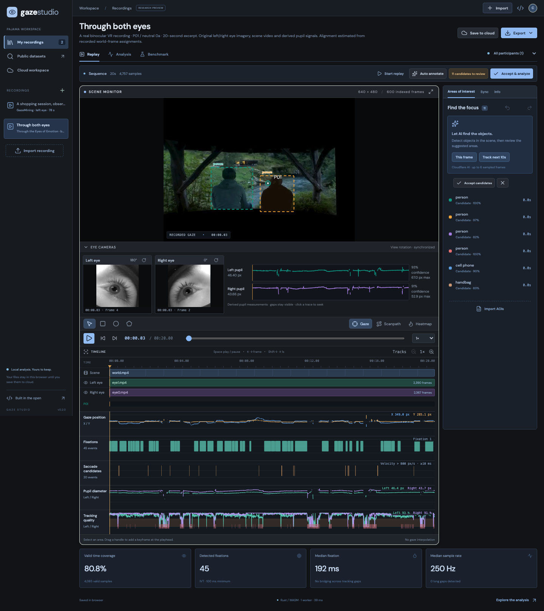

# Gaze Studio

An open source workspace for aligned video and gaze replay, dynamic areas of interest, and reproducible eye tracking analysis. English interface. Rust/WASM analysis, reusable React controls, Cloudflare infrastructure.

**[Component example](https://gaze.pajama.studio/embed/?sample=binocular)** · **[Modules](docs/MODULES.md)** · **[Raw eye videos](docs/BINOCULAR.md)** · **[Cloud data library](docs/CLOUDFLARE-DATA.md)**

**[Open the app](https://gaze.pajama.studio)** · **[详细规划（中文）](docs/PLAN.zh-CN.md)** · **[Gaze Package format](docs/FORMAT.md)** · **[Methods](docs/METHODS.md)** · **[Dataset index](docs/DATASETS.md)**



## What works

- Inspect five synchronized data tracks: gaze X/Y, fixations, saccade candidates, left/right pupil diameter and tracking quality. Select events to inspect duration/amplitude/peak speed, seek all videos, and export event CSVs. [Definitions and limits](docs/SIGNAL-TRACKS.md).
- Edit in a graphite workspace with a multi-track timeline, scrubbing/zoom, keyboard playback, frame stepping, AOI undo/redo and independently rotatable eye monitors.
- Replay independent left/right raw eye videos alongside the viewed scene on one timeline. Preserve each camera’s clock, visibility interval and frame timestamps. Inspect and seek per-eye pupil traces.
- Replay MP4, WebM and images with gaze, fixation scanpaths and duration-weighted heatmaps. Use actual frame PTS and editable clock anchors; no FPS-based gaze alignment.
- Import mapped CSV/TSV, Pupil Cloud CSV, GazeCom ARFF, a BIDS physio subset, and portable Gaze Package ZIPs. Keep original input files with the normalized data.
- Draw rectangles, ellipses and polygons. Edit visibility intervals, add dynamic keyframes, undo edits, and import Cogix AOIs with explicit coordinate metadata.
- Propose object AOIs with Cloudflare Workers AI DETR, associate detections across sampled frames, and review candidates before analysis. Extract recorded fixed DOM regions from the included GazeMining source.
- Run I-VT / I-DT fixation detection, tracking-quality checks, AOI dwell / visits / TTFF / transitions, pupil summaries, participant filtering, time windows, and CSV/JSON exports in Rust/WASM, with complete participant streams distributed across a bounded pool of Web Workers.
- Compare independent prediction and reference CSVs: mean/median/P90/RMSE pixel error, angular error with supplied screen geometry, per-participant results, pairing coverage and controlled constant-target precision.
- Save immutable recording revisions to private browser-session workspaces in Cloudflare R2 + D1. Video streaming supports HTTP ranges. Original inputs and analysis snapshots accompany uploads.

The default example is a **real binocular eye-camera recording**: a 20-second excerpt from Through the Eyes of Emotion, with both eye videos, VR scene and gaze. It uses estimated gaze/scene alignment and retains the original source files in our R2 archive; [provenance and limits](docs/BINOCULAR.md). A real 78-second GazeMining replay remains available. Attention Garden has been removed from the workspace and public assets; synthetic fixtures exist only in the test suite. Neither real replay constitutes a webcam-model accuracy benchmark.

## Run locally

Node 22.22+, Rust 1.94.1 and wasm-pack 0.15.0 are used by CI.

```sh
rustup target add wasm32-unknown-unknown
cargo install wasm-pack --version 0.15.0 --locked
```

```sh
npm ci
npm run build
npm run db:local
npm run seed:local
# Optional: seed the owned binocular example into the test-config R2/D1:
# node scripts/seed-ci-library.mjs
npm run dev:api
# In a second terminal:
npm run dev
```

Open `http://127.0.0.1:5198`. The Vite server proxies `/api` to the Worker on port 8798. You can also use `http://127.0.0.1:8798` to view the built app.

Local replay, imports and analysis work without Cloudflare credentials. Workers AI calls require a logged-in Wrangler session and execute on Cloudflare even in development. For fully offline development, remove the `ai` binding; inference then remains unavailable. No third-party font, analytics or model CDN is loaded by the browser.

## Self-host entirely on Cloudflare

1. `npx wrangler login`
2. Create your resources: `npx wrangler d1 create gaze-studio` and `npx wrangler r2 bucket create YOUR-UNIQUE-BUCKET`.
3. Replace the example database ID, bucket name and Worker name in `wrangler.jsonc`. Replace the `routes` custom domain with one you own, or remove it to use `workers.dev`. These values identify this deployment, not credentials.
4. `npx wrangler d1 migrations apply gaze-studio --remote --config wrangler.jsonc`
5. Seed the public example: `npx wrangler r2 object put YOUR-UNIQUE-BUCKET/examples/gazemining-amazon.webm --file public/datasets/gazemining-amazon.webm --content-type video/webm --remote --config wrangler.jsonc`.
6. `npm run deploy`

Workers serves the app and API; D1 stores ownership and metadata; R2 stores media, gaze, raw attachments and analysis snapshots; Workers AI supplies optional object detection. Browser workers perform interactive numerical analysis. No external application server is required. The curated dataset library includes SHA-256 inventories, complete selected source trials and replay derivatives; see [data storage and reproduction](docs/CLOUDFLARE-DATA.md).

The preview creates an opaque, HttpOnly session cookie when you first use cloud features. It is **not a team account system**. Export portable packages before clearing the browser session. The deployment has explicit caps: 10 recordings per workspace, 100 MiB per uploaded object, 1 GiB cumulative uploads, 100 AI requests/day and 100 new sessions/day. Configure your own limits and authentication before a large public service. Local imports are limited to 500,000 samples per recording.

## Reproduce and verify

```sh
npm run test:rust
npm run build:wasm
npm test
npm run build:ui
npm run test:browser
# Optional, against another deployment:
BASE_URL=https://your-worker.workers.dev npm run test:browser
```

Browser verification creates and deletes a private cloud test recording. It does not invoke paid AI by default. See [verification notes](docs/VERIFICATION.md).

```sh
# Index actual media frame presentation times:
python3 scripts/frame-index.py stimulus.webm --out frame-clock.json

# Convert Pupil Cloud gaze and frame clocks without losing epoch-nanosecond precision:
python3 scripts/convert-pupil.py --gaze gaze.csv --world world_timestamps.csv \
  --video scene.mp4 --out converted

# Evaluate supplied model predictions against independent labels:
node scripts/benchmark.mjs --predictions predictions.csv --reference reference.csv \
  --protocol protocol.txt --width 1920 --height 1080 --tolerance-ms 8 --out benchmark.json
```

EVE labels can be inspected and converted with `scripts/convert-eve.py`; its optional dependencies are `h5py` and `numpy`. Dataset access and the actual webcam model execution are separate from the viewer and label-scoring tool. **No live-webcam accuracy claim is made by this project.**

## Scope and interoperability

Gaze Package 0.2 is an experimental application interchange format, **not an established industry standard**. BIDS 1.11 already defines eye tracking physiological files. We preserve interoperability while adding the explicit media clock, frame index, portable assets, AOI keyframes and checksums a web player needs.

BIDS import supports one continuous physio stream plus a supplied sidecar, explicit units and coordinate mapping. The export is marked **BIDS draft**: one participant, known recorded eye, uniform sampling; it still requires complete device/stimulus metadata and a BIDS validator review. Irregular streams are not silently resampled.

Large archive streaming, Arrow/Parquet, DuckDB-Wasm queries, background Workflows/Queues jobs, team authentication, multi-rater adjudication, pursuit classification and full BIDS dataset curation are planned in [the implementation roadmap](docs/PLAN.zh-CN.md). They are not hidden behind placeholder buttons.

## License

New application and analysis code: [MIT](LICENSE). The binocular research data retain their CC BY 4.0 license, with third-party stimulus rights preserved; HARMONIC sources are archived privately because no explicit redistribution license was located. The GazeMining sample remains under its original CC0 dedication; displayed third-party page content retains its own rights. Fonts use SIL OFL. See [THIRD_PARTY.md](THIRD_PARTY.md). Existing private Cogix repositories were used to understand interfaces; their code was not copied into this public project.
