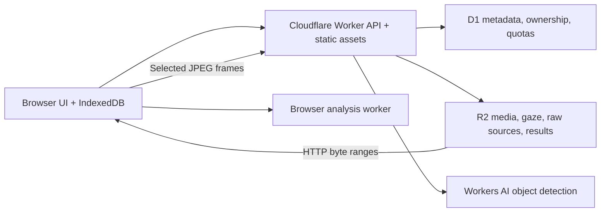

# Gaze Studio：研究结论、产品设计与实施规划

调研日期：2026-09-06。代码与部署能力见 README；这里区分已实现功能、研究判断和后续工程。

## 1. 结论与产品价值

可以做，而且比单纯“再做一个 gaze 点播放器”更有价值。真正困难的是：研究者拿到录像和样本之后，要弄清坐标、时间、校准、缺失值、版本和 AOI 规则，然后才能比较参与者或算法。我们的产品应把这些过程变成可检查、可分享、可复现的工作流。

我建议定位为：**开放的眼动数据工作台与数据交换层**。它既服务数据集整理，也服务你后续的 AI 交互和 Three.js 项目。采集算法可以更换，游戏或 AI 界面只负责输出统一的 gaze、内容时间和内容区域；同一套回放与分析继续复用。

不能把市场判断建立在“没有 viewer”上。GazePlotter 已经提供浏览器本地分析、多厂商导入与 AOI 指标；gazeMapper 解决可穿戴录像的映射、同步和验证；pymovements 提供成熟的 Python 数据与事件分析。我们的机会是把**公开数据组织、显式媒体同步、动态 AOI、算法评测和轻量云分享**连起来，减少各工具之间的转换成本。[GazePlotter](https://gazeplotter.com/docs/) · [gazeMapper](https://github.com/dcnieho/gazeMapper) · [pymovements](https://github.com/pymovements/pymovements)

## 2. 公开数据究竟能验证什么

| 输入材料                               | 能做的评测                                           | 不能据此声称的结果                   |
| -------------------------------------- | ---------------------------------------------------- | ------------------------------------ |
| 观看的视频/图片 + gaze 坐标            | 同步回放、AOI 命中、数据质量、scanpath/saliency 分析 | 自己的 webcam 模型达到某个角度精度   |
| gaze + 专家事件标签                    | fixation/saccade/pursuit 分类质量                    | 从脸部图像估计 gaze 的质量           |
| 脸部/眼部图像 + 标定几何 + 参考 gaze   | RGB 估计模型的离线泛化、角度/像素误差                | 普通浏览器、任意光照下的真实部署表现 |
| 同步脸部视频 + 屏幕内容 + 参考 gaze    | 时间模型、内容辅助、在线校准策略的研究               | 不受数据域偏差影响的“商业级精度”     |
| 本人的相机 + 独立验证点 + 后续漂移测试 | 产品端真实误差、覆盖率、时延与可用性                 | 跨人群结论，除非采集足够多独立参与者 |

EVE 是最贴合 webcam + AI 交互研究的选择，因为它同时有面向参与者的相机、屏幕录像和参考 gaze。但它需要申请，采用 CC BY-NC-SA 4.0 并附加条件；不能当作随意镜像、商业训练的数据源。本轮没有获得 EVE 原始授权下载，也没有运行 webcam 模型评测，因此没有产生一个声称属于我们模型的角度精度数字。[EVE 官方项目](https://ait.ethz.ch/eve) · [官方代码](https://github.com/swook/EVE)

已实现评测器接受独立预测与参考 CSV，按参与者和时间匹配，报告 mean / median / P90 / RMSE、匹配覆盖率、参与者分别的结果与宏平均。有屏幕物理尺寸和观看距离时，用两条视线向量的夹角计算角度误差。它还会在明确的恒定参考目标区间报告位置精密度；不会把 RMSE accuracy 和 precision 混为一谈。

推荐我们的实测协议：

1. 固定 baseline 与新算法版本；先划分参与者，再进行训练/调参。
2. 训练、校准、最终测试严格分离。校准后冻结参数，禁止用测试目标继续修正模型。
3. 同时保存原始预测、滤波预测、有效性、相机帧 PTS、推理耗时和设备信息。
4. 分别测静态正视、头部移动、照明、眼镜、观看距离和 5/15/30 分钟漂移。
5. 同时报告数据丢失率与误差；不要只计算模型愿意输出的容易样本。
6. 对 AI 交互额外评估大 AOI 命中率、目标选择时间、误触发率、用户偏好。产品改善不一定要求达到硬件眼动仪的细粒度精度。

## 3. 格式：采用 BIDS，补上播放器真正需要的信息

眼动已经进入 **BIDS 1.11**，不是还只能等待的提案。规范要求按眼拆分的 `physio.tsv.gz`、JSON sidecar、timestamp/x/y、采样频率、坐标系统等；刺激事件可以借助 BIDS events 与 stimuli 组织。[BIDS 1.11.1 眼动规范](https://bids-specification.readthedocs.io/en/stable/modality-specific-files/physiological-recordings.html) · [眼动进入 BIDS 的论文](https://pmc.ncbi.nlm.nih.gov/articles/PMC12889726/)

但是，一个公共科研存档规范并不自动等于一个可直接拖进网页的媒体工作包。我们定义 **Gaze Package 0.1** 作为应用交换层，同时保留 BIDS 导入/导出桥接：

- 一个包对应一个刺激录像/图片及与之绑定的一个或多个参与者；研究/数据集目录可以包含很多包。
- 媒体保持 MP4/WebM/JPG/PNG，保留原始分辨率与坐标原点。
- gaze 用相对整数微秒；绝对 Unix 纳秒以字符串保留，先做大整数差再转 Number。
- 视频以真实 presentation timestamp 索引，不用 `frame / FPS` 推测掉帧或可变帧率。
- 用一个或多个同步锚点表示 gaze 时钟到媒体时钟的映射；漂移校正可见、可导出。
- AOI 保存几何形状、可见区间、关键帧、来源、置信度和是否接受。
- 原始输入、转换说明、文件 SHA-256 和分析参数随包保存。

这不是宣称另一个行业标准；它是一份公开、版本化、有校验器和往返测试的候选协议。格式细节、兼容范围与演进规则见 [FORMAT.md](FORMAT.md)。Pupil 自身已经把视频帧时间与 gaze 时间分开保存，这也是我们必须遵守的基本设计。[Neon 数据格式](https://docs.pupil-labs.com/neon/data-collection/data-format/) · [Pupil Core 格式](https://docs.pupil-labs.com/core/software/recording-format/)

## 4. 产品流程与目前实现

| 用户动作 | v0.1 实现                                                                               | 验收方式                                   |
| -------- | --------------------------------------------------------------------------------------- | ------------------------------------------ |
| 找数据   | 10 个数据集的信号/用途/访问条件目录                                                     | 可搜索并跳转原始来源，不假装已取得限制数据 |
| 导入     | 列映射、单位、原点、尺寸、坐标方向、源文件保留                                          | 纳秒、大时间戳、NaN、负坐标、重复时间测试  |
| 回放     | 视频/图片、播放速度、seek、PTS 帧步进、gaze/scanpath/heatmap                            | 真实 GazeMining 文件与浏览器测试           |
| 同步     | 多锚点编辑、frame clock JSON 导入、偏移/漂移映射                                        | offset/inverse/VFR 单元测试                |
| AOI      | 矩形、椭圆、多边形、可见区间、关键帧、撤销、JSON                                        | 绘制、拖动、关键帧、undo、包往返测试       |
| 自动 AOI | Workers AI DETR 候选、6 帧采样关联、镜头变化保护；GazeMining 已录 DOM 区域              | 已完成真实推理；候选必须接受才统计         |
| 分析     | I-VT、I-DT、有效时间、采样间隔、fixation、AOI dwell/visits/TTFF/转移、瞳孔/眨眼样本汇总 | 已知输入的定量测试，所有参数随报告导出     |
| 精度评分 | 预测/参考 CSV、参与者隔离、唯一配对、pixel/angular error、coverage、静态目标 precision  | 独立已知误差样本，避免自我打分             |
| 云保存   | R2 文件、D1 私有目录、HttpOnly 会话、immutable revision、Range 视频                     | 上传→重新打开→seek→删除验证                |
| 交换     | ZIP+checksums、CSV、AOI JSON、analysis JSON、有限 BIDS draft                            | 导出后重新导入，并检测篡改                 |

界面全部英文。公开仓库位于 [pajama-studio/gaze-studio](https://github.com/pajama-studio/gaze-studio)，正式入口为 [gaze.pajama.studio](https://gaze.pajama.studio)。原有 eye-tracking Three.js 游戏保留，新工作台独立维护。Cogix 旧项目的接口设计已调研；新公开仓库没有复制私有实现。特别核实了旧 AOI 的矩形 `[x,y,w,h]`、椭圆 `[cx,cy,rx,ry]` 与规范化坐标，转换时要求元数据明确，避免无声画错。

## 5. Cloudflare 架构与规模化路径

视频和每个 gaze 样本都塞入 D1 是错误的扩展方向。D1 应存目录、对象位置、权限、schema、job 状态与小型聚合；R2 存原始对象和衍生文件。浏览器 Web Worker 承担交互式数值分析，避免把 Worker 当作常驻 Python/GPU 服务器。R2 原生支持 range 与 multipart，可用于后续大型文件上传和读取。[R2 Worker API](https://developers.cloudflare.com/r2/api/workers/workers-api-reference/) · [R2 limits](https://developers.cloudflare.com/r2/platform/limits/)

目前部署是有上限的 research preview：单记录 50 万样本、单对象 100 MiB、10 个云端记录/浏览器会话、全局累计 1 GiB 上传、100 次 AI 调用/天。这个限制是本应用选择的预算与内存边界，**不是 Cloudflare 的理论容量**。不能把当前把 CSV 全量载入内存的实现宣传成已经可以浏览 TB 级数据。

后续大数据实现分两层：

1. **分片存储与按需读取**：按 recording/participant/trial/time 分区；R2 上使用 Arrow/Parquet 或带时间索引的压缩 CSV 分片。manifest 的索引记录时间范围、schema、sha256、统计量。只读取当前播放窗口和分析选择范围。原始视频 Range 读取保持不变。
2. **异步分析**：D1 创建 job → Queue 派发 → Workflow 记录断点与版本 → 分批读取 R2 → 写结果与指标 → UI 轮询/SSE。任务幂等键至少包含 source hash、参数 hash、算法版本、AOI revision。跨分片算法要保留边界窗口，不能在分片边缘制造 fixation。

浏览器 SQL 用 DuckDB-Wasm 查询 Arrow/Parquet，Worker 端仅执行受控任务；重型自定义模型训练与任意 PyTorch 运算不能靠普通 Worker 自动完成。纯 Cloudflare 部署可优先用 Workers AI 提供的模型，浏览器负责视频解码与抽帧。目前这些大数据/后台队列能力属于下一阶段，仓库里没有假任务队列。[Workers AI DETR](https://developers.cloudflare.com/workers-ai/models/detr-resnet-50/)

## 6. 自动 AOI 的三条实际路线

| 内容               | 首选方法                                                    | 人工复核点                                    |
| ------------------ | ----------------------------------------------------------- | --------------------------------------------- |
| 自己的网页/AI 界面 | DOM 角色、文字、按钮、图片框、scroll/resize/navigation 事件 | 可见性、遮挡、滚动容器、坐标与 capture 时间   |
| Three.js 游戏      | 对象 ID + 相机投影后的屏幕区域；必要时 depth/occlusion test | 是否真正可见，透明对象、粒子、屏幕外对象      |
| 只有录像的真实场景 | 检测/分割 → 跟踪 → 关键帧修正 → gaze 命中                   | 类别适配、ID switch、遮挡、镜头切换、边界误差 |

当前 DETR 是 COCO 常见物体检测，不擅长理解 UI 按钮、文本段落或对话轮次；不能把“自动画了一堆框”当作语义 AOI 解决方案。采样检测 + 同类别 IoU 关联也不能代替密集运动跟踪。对自己的 AI 界面，优先从 DOM 获取真实结构；仓库有 `captureDOM` 的同源采集接口。GazeMining 的 recorded layer adapter 已可用。

下一阶段增加 OCR/text block、SAM 类分割和更稳健的跟踪器时，保留统一的 `AOI`/keyframe 接口即可。模型输出是可撤销的建议，人工接受之后生成 annotation revision。对于研究用途，需要预先定义 AOI 命名与重叠规则，并报告标注者一致性。相关方向已有 Gaze2AOI 与 dynamic-aoi-toolkit，适合比较和互通。[Gaze2AOI](https://arxiv.org/abs/2411.13346) · [dynamic-aoi-toolkit](https://github.com/treyescan/dynamic-aoi-toolkit)

## 7. 从 raw data 出发的完整分析蓝图

顺序应是：原始保留 → schema/时钟/坐标验证 → 质量报告 → 可选预处理 → 事件检测 → AOI/轨迹/瞳孔分析 → 组间统计 → 可复现报告。每步产生有输入 hash 和参数的 derivative。

已实现基础质量、fixation、AOI 与评测指标。完整研究版继续增加：

- 质量：按眼有效性、每个采样间隔、漂移/标定误差、数据丢失区间、双眼差异、采样率分布、原始与滤波信号比较。
- 事件：可替换的 I-VT/I-DT/REMoDNaV 或其他验证过的分类器；明确 saccade、pursuit、blink、unknown；样本级与事件级评分分开。
- AOI：dwell 与 fixation duration 分开、revisit、TTFF censoring、transition probability、同一对象跨镜头身份、静态/动态 AOI 边界不确定性。
- 轨迹：scanpath 长度、方向、空间密度、AOI 序列、MultiMatch/ScanMatch 等带版本的方法；不把随机采样 gaze 线段当作 fixation scanpath。
- 瞳孔：单位、缺失与 blink masking、插值策略、基线窗口、光照/距离混杂项；不给无依据的“专注力/认知负荷分数”。
- 统计：参与者是独立单位；bootstrap CI、效应量、重复测量/混合模型、多个检验修正；避免把数百万相关 gaze 样本当独立样本。
- 报告：图表、参数、采集/排除流程、数据与 AOI revision、软件版本、可重跑的配置文件。

当前数值定义与已知限制详见 [METHODS.md](METHODS.md)。

## 8. 分阶段路线与验收

| 阶段            | 交付                                                                                                     | 完成标准                                               |
| --------------- | -------------------------------------------------------------------------------------------------------- | ------------------------------------------------------ |
| P0：当前 v0.1   | 可运行、可自托管工作台，真实样本，格式、导入、回放、AOI、分析、云保存与评测器                            | 当前仓库实现；单元/浏览器/Cloudflare 验证              |
| P1：数据工程    | D1 study/session/trial 目录；批量导入；原始/衍生 revision；BIDS 完整导出与 validator；Cogix 更多版本迁移 | 3 个真实异构数据集，无人工改源码导入；相同包结果可复现 |
| P2：研究分析    | 事件标签评测、pursuit/saccade/blink、baseline pupil、统计与报告、DuckDB 查询                             | 对照 pymovements/其他参考实现；人工审查边界案例        |
| P3：数据规模    | R2 multipart、分片索引、可取消异步 job、Workflow/Queue、增量视图                                         | 百万/千万样本压测；首帧/首图延迟、内存、成本实测       |
| P4：协作标注    | 团队账户、项目权限、邀请、share link、双人标注和版本比较                                                 | 权限隔离、审计、恢复、删除策略通过测试                 |
| P5：AI/游戏闭环 | 统一 gaze provider/内容 capture adapter；DOM/Three.js AOI；线下回放评测与线上交互数据一致                | 同一游戏替换模型无需修改统计；交互收益有独立用户实验   |

小团队排期可按 P1/P2 各 1–2 周、P3/P4 各 2–3 周估算，但应先验证真实数据、团队需求和用量。优先验证科研人员能否不用写脚本完成一次数据导入、标注和分析，而非堆模型数量。

开源策略：格式和分析核心 MIT；数据来源独立标注许可；公开小型可重现例子与 conformance tests；提供自托管 Cloudflare 配置。商业服务的潜在收费点是协作、存储、批处理和维护，而不是锁住用户的 gaze 数据或导出格式。
